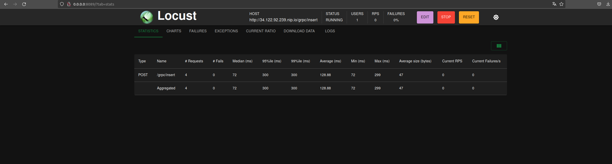
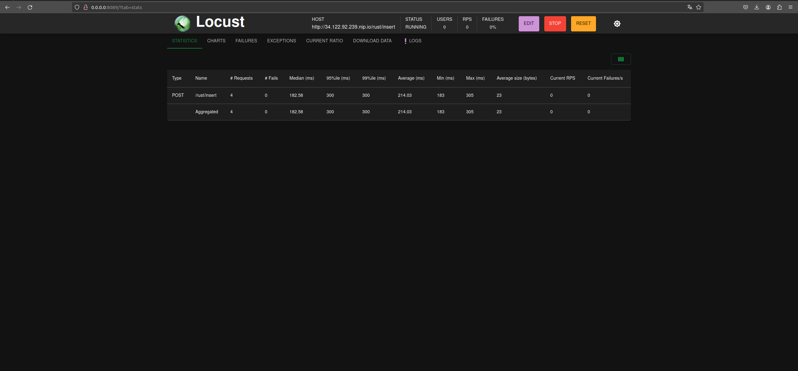
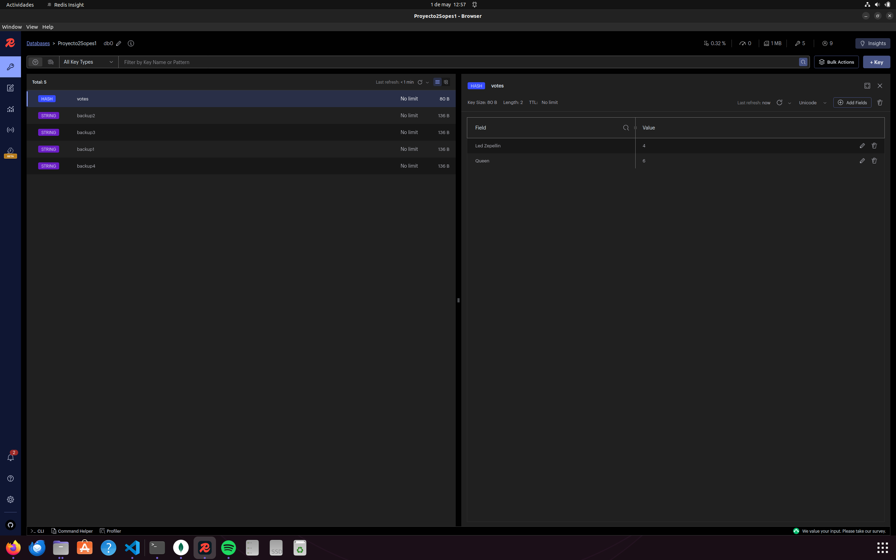
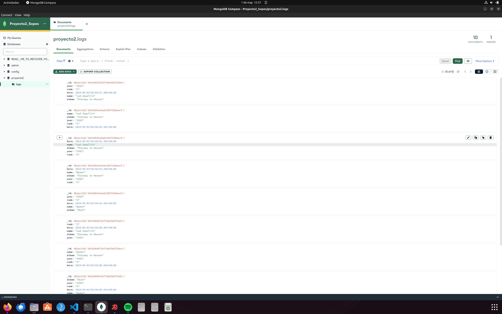
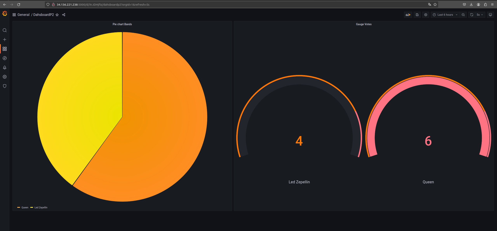

# Proyecto 2
## Juan Pedro Valle Lema

## Introducción

En este proyecto presentamos un sistema de de votacion para un concurso de musica que se llevara a cabo 
en Guatemala. Esta recibira los votos de las personas por medio de informacion enviada por un ingress hacia 
dos servicios diferentes, uno realizado en grpc y otro realizado con rust, los cuales se encargan de encolar y enviar los datos recibidos
hacia un servicio de Kafka. Posteriormente tenemos un consumidor a la escucha de los votos que lleguen por medio de Kafka, esto para
posteriormente subir los mismos a una base de datos de Redis y a una base de Datos de mongo. Dentro de redis tendremos una llave, un valor y un contador, estos datos
nos seran de mucha utilidad para realizar una interfaz grafica en tiempo real por medio de grafana.
Mientras del lado de mongo tendremos logs, es decir hora y fecha en que se realizo el voto y porque banda fue el mismo. Cada uno de los servicios 
mencionados anteriormente ademas fue desplegado en un cluster de Kubernetes alojado en Google Cloud Platform.

## Objetivos

- Implementar un sistema distribuido con microservicios en kubernetes, para conocer mas sobre servicios en la nube
y como aplicaciones completas pueden ser desplegadas en la misma.
- Encolar distintos servicios con sistemas de mensajeria, para conocer cual puede ser mas eficiente en este proceso.
- Utilizar Grafana como interfaz grafica de dashboards y asi observar los resultados obtenidos en tiempo real.
- Determinar que tipo de servicio es mas eficiente realizando el trabajo de productor, entre grpc y rust.

## Descripción de cada tecnología utilizada

### Kubernetes

Kubernetes es una plataforma portable y extensible de codigo abierto para administrar cargas de trabajo y servicios. Este nos facilita
la automatizacion y la configuracion de forma declarativa, ademas presenta un ecosistema grande y en rapido crecimiento. Este fue un proyecto liberado
por google en 2014. Kubernetes puede ser visto como una plataforma de contenedores, servicios y una plataforma portable en la nube. El entorno que nos 
ofrece es basado en contenedores, donde este mismo se encarga de orquestar la infraestructura de computo, redes y almacenamiento para que las cargas
de trabajo de los usuarios no tengan que hacerlo.

### Docker

Docker es una tecnologia que nos permite organizar contenedores que posilibitan la creacion y uso de contenedores Linux. Esta se basa en utilizar
los contenedores como maquinas virtuales livianas y modulares, obteniendo la flexibilidad necesaria para crearlos, implementarlos, copiarlos he incluso
trasladarlos de un entorno a otro, permitiendo optimizar aplicaciones en la nube.

### Locust

Locust es una herramienta que nos permite crear escenarios de prueba de forma rapida y sencilla. Esta nos permite trabajar con codigo de python, para
crear multiples peticiones a nuestro servicio con usuarios simultaneos.

### Rust

Rust es un lenguaje de programacion sumamente rapido y eficiente con la memoria, este no tienen runtime ni recolector de basura, puede sustentar servicios 
de rendimiento critico, ejecutarse en dispositivos integrados, y colaborar con otros lenguajes de forma sencilla. Rust nos brinda una documentacion extensa y un compilador
accesible que presenta de forma clara los errores que encuentra en nuestor codigo.

### Rocket

Esta es una libreria que permite el desarrollo web dentro de rust

### Golang

Es un lenguaje de programacion desarrollado por google, caracterizado por su simplicidad y eficiencia, utilizado para desarrollar una amplia gama de aplicaciones, desde
programas en consola hasta sistemas distribuidos y aplicaciones web.

### Fiber

Esta es una libreria que permite el desarrollo web de forma sencilla dentro de go.

### GRPC

Este es un sistema de llamada a procedimiento remoto de codigo abierto, desarrollado inicialmente por google. Este se emplea en comunicaciones cliente-servidor distribuidas por su
eficiencia gracias a la ingenieria de procesos basada en RCP. Este mecanismo permite la comunicacion de una forma sencilla tanto que pareciera una comunicacion local entre procesos en la misma
maquina. Este utiliza el protocolo de tranporte http/2 permitiendo una mayor eficiencia en la transmision de datos, debido a que utiliza una unica conexion creando una comunicacion bidireccional.
Este es sencillo de implementar ya que no necesita llamadas a demasiadas funciones. Es bastante flexible ya que permite ser usado en multiples lenguajes. Por ultimo, presenta un rendimiento alto, convirtiendolo en una 
alternativa atractiva para llamadas entre servicios en lugar de utilizar las tradicionales llamadas HTTP.

### Redis

Este es un motor de base de datos NoSQL basado en el almacenamiento de tablas hash. Permitiendo almacenar pares de clave-valor, es utilizado principalmente como memoria cache de aplicaciones
o base de datos de respuesta rapida. Al almacenar datos en memoria, en lugar de un disco o un SSD, Redis ofrece una velocidad, fiabilidad y rendimiento incomparable.

### MongoDB

Es un motor de base de datos NoSQL que ofrece una gran escalabilidad y flexibilidad. Este tienen drivers para multiples lenguajes lo que lo vuelve sumamente util.
Ademas, es bastante facil de aprender y usar. Este almacena los datos en documentos flexibles similares a un JSON, por lo que los campos pueden variar entre documentos y 
la estructura de datos puede cambiar con el tiempo.

### Grafana

Esta es una herramienta de interfaz de usuario que se enfoca en la obtencion de datos a partir de consultas, al igual que el almacenamiento de estos y su posterior visualizacion en diversos tipos de grafico.
Esta es completamente de codigo abierto, y esta respaldada por una comunidad extensa. La filosofia de esta se basa en 4 razones. La primera, unificar los datos, no las bases de datos. La segunda, datos que
todo el mundo puede ver. Tercera, paneles que cualquiera puede usar. Por ultimo la cuarta, flexibilidad y versatilidada.

## Descripción de cada deployment y service de K8S.

### Ingress

Este es un servicio que se realizo por medio de nginx y helm, nos permite enrutar a diferentes puertos y endpoints por medio de una sola ip.

### GRPC

Este es el deployment encargado de crear el pod para nuestros servicios de grpc en este caso del cliente y el servidor. Nos permite exponer los puertos
3000 y 3001. Este solo presenta una replica y utiliza imagenes de docker subidas a dockerhub. En el caso del servicio es de tipo ClusterIP y se encarga
de exponer por TCP el puerto 3001 que es el del cliente, siendo este el principal para la transmision de los votos.

### RUST

Este es el deployment encargado de crear el pod para nuestros servicios de rust en este caso del cliente y el servidor. Nos permite exponer los puertos
8000 y 8080. Este solo presenta una replica y utiliza imagenes de docker subidas a dockerhub. En el caso del servicio es de tipo ClusterIP y se encarga
de exponer por TCP el puerto 8000 que es el del cliente, siendo este el principal para la transmision de los votos.

### Consumer

Este es el deployment de nuestro consumidor, este presenta dos replicas y tiene la capacidad de autoescalar horizontalmente por medio de un HPA aplicado al mismo
para poder llegar hasta un maximo de 5 replicas. Este utilzia la imagen de docker de nuestro consumidor dentro de dockerhub.

### Kafka

Este deployment nos permite utilizar la herramienta de kafka para transmision de mensajes. El servicio de este es de tipo ClusterIP, en este se exponen puertos de TCP
como el 9092 los cuales son usados para los brokers y como canales de transmision.

### Grafana

Este deployment nos permite utilizar la herramienta de grafana para su uso como interfaz visual. El servicio de este es de tipo LoadBalancer para que podamos acceder al mismo
por medio de una IP externa brindada por nuestro cluster. En el servicio del mismo utilizamos como targetPort el puerto 3000, pero exponemos el puerto 5000, esto para que no choque
con el puerto usado por nuestro servicio de GRPC.

### Mongo

Este deployment se encarga de brindarnos la imagen de mongoDB al igual que de crear un persistent volum claim, con el cual no perder nuestros datos si nuestra base de datos llegara
a sufrir un reinicio. El servicio de este es de tipo ClusterIP para poder obtener una IP externa y asi poder conectarnos a visualizadoes como mongo Compass. En el deployment se hace
peticion a recursos como cantidad de memoria y cpu. Al igual que se menciona el puerto a exponer en este caso el 27017.

### Redis

Este deployment se encarga de brindarnos la imagen de redis al igual que de crear un persistent volum claim, con el cual no perder nuestros datos si nuestra base de datos llegara
a sufrir un reinicio. El servicio de este es de tipo ClusterIP para poder obtener una IP externa y asi poder conectarnos a visualizadoes como redis Insight. En el deployment se hace
peticion a recursos como cantidad de memoria y cpu. Al igual que se menciona el puerto a exponer en este caso el 6379.

## Ejemplo de funcionamiento con capturas de pantalla.

### Carga de datos por medio de Locust

### Visualizacion datos en redis

### Visualizacion datos en mongo

### Visualizacion datos en Grafana

## Conclusiones

- Por medio de kubernetes se logro conocer mas sobre los servicios en la nube y que aplicaciones pueden realizarse en esto, junto
a los tipos de servicio que se presentan y la funcion que cada uno de estos nos brinda.

- La nube es un recurso muy util y versatil que nos permite ejecutar aplicaciones completas de forma sencilla por medio de herramientas
como docker.

- Kafka es una herramienta util al momento de querer encolar y enrutar mensajes de un servicio a otro sin tener que enviarlos de forma
directa o por medios como una peticion HTTP comun.

- Grafana es una herramienta muy util al momento de visualizar datos que pueden provenir de bases de datos de forma ordenada y comprensible, esta
presenta diversos tipos de grafico que permiten que cada usuario decida el tipo que quiere usar para sus trabajos. Ademas presenta una facilidad
grande al momento de acceder a los datos sin muchos problemas.

## Preguntas a responder

### ¿Qué servicio se tardó menos? ¿Por qué?

El servicio que menos tiempo tardo en el envio de los votos fue grpc, esto porque grpc utiliza el metodo de comunicacion HTTP/2 donde gracias a la capacidad de multiplexacion no debe esperar respuesta 
del servidor para continuar el envio junto a esto esta el echo de que no envia los datos de poco en porciones como en el caso de Rust que utiliza un servicio de apis normal es decir basado en HTTP, si no como
un grupo entero.

### ¿En qué casos utilizarías grpc y en qué casos utilizarías wasm?

Utilizaria grpc cuando necesito realizar un envio de grandes cantidades de informacion provenientes de una peticion, esto ya que permitiria brindar tiempos de respuesta mas veloces y 
un menor tiempo de espera. Un area donde lo aplicaria seria busquedas de datos, ya que permitiria que se hagan multiples peticiones a la misma junto al poder regresar las diversas respuestas de forma mucho mas rapida.

Por otro lado utilizaria wasm o Rust, en aplicaciones donde las peticiones no son muy exigentes, pero quiero una mejor eficiencia de recursos como cpu y memoria en mi aplicacion web. Esto debido
al buen control y manejo de los mismo que Rust nos brinda junto a la versatilidad que este presenta, gracias a que webAssembly nos brinda la capacidad de ejecutar codigo de multiples lenguajes a una velocidad practicamente nativa, permitiendo uso de lenguajes como C/C++ y Rust para que trabajen junto a JavaScript.. Otra area donde usaria este tipo de herramientas es para la construccion de aplicaciones de escritorio.
